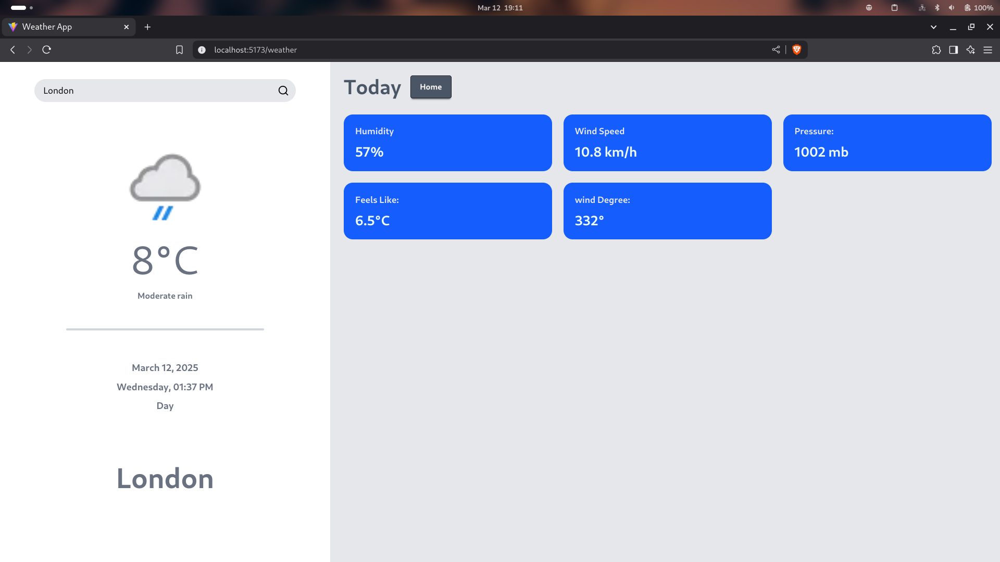

# Weather App

A modern weather application built with React and TypeScript that provides real-time weather information using the WeatherAPI.com API.



## Features

- Real-time weather data display
- Search functionality for any location
- Detailed weather information including:
  - Temperature
  - Weather conditions
  - Humidity
  - Wind speed
  - Location details
- Responsive design for all devices
- Error handling with user-friendly messages
- Clean and intuitive user interface

## Technologies Used

- React 18
- TypeScript
- Vite
- CSS3
- WeatherAPI.com
- Environment Variables for secure API key storage

## Installation

1. Clone the repository:

```bash
git clone https://github.com/yourusername/WeatherApp.git
cd WeatherApp
```

2. Install dependencies:

```bash
npm install
# or
pnpm install
```

3. Create a `.env` file in the root directory and add your WeatherAPI.com API key:

```bash
VITE_WEATHER_API_KEY=your_api_key_here
```

4. Start the development server:

```bash
npm run dev
# or
pnpm dev
```

5. Open your browser and navigate to `http://localhost:5173`

## API Reference

This project uses the [WeatherAPI.com](https://www.weatherapi.com/) for fetching weather data. To use this application, you'll need to:

1. Sign up for a free account at [WeatherAPI.com](https://www.weatherapi.com/)
2. Get your API key from the dashboard
3. Add the API key to your `.env` file

## Environment Variables

The following environment variables are required:

```bash
VITE_WEATHER_API_KEY=your_api_key_here
```

## Contributing

1. Fork the repository
2. Create your feature branch (`git checkout -b feature/AmazingFeature`)
3. Commit your changes (`git commit -m 'Add some AmazingFeature'`)
4. Push to the branch (`git push origin feature/AmazingFeature`)
5. Open a Pull Request

## License

This project is licensed under the MIT License - see the `LICENSE` file for details.
